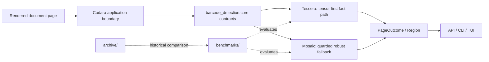

# Repository architecture

The repository has one source of truth for each kind of work:

| Area | Responsibility | Status |
| --- | --- | --- |
| `src/barcode_detection/core` | Shared engine contracts and domain vocabulary | Stable repository boundary |
| `src/barcode_detection/engines` | Dependency-free catalog plus Tessera/Mosaic implementation boundaries | Stable metadata; runtime migration point |
| `src/barcode_detection/integrations/codara` | Copied engine adapters and their Codara lineage | Current integration snapshot |
| `apps` | API, CLI, and TUI application boundaries | Reserved for migration from Codara |
| `benchmarks` | Neutral evaluation code, fixtures, and committed benchmark results | Active research/evaluation |
| `archive/experiments` | Exploratory `bin/` and notebook work | Frozen reference |
| `archive/versions` | Official numbered versions 1 through 8 | Frozen reference |
| `reports` | Authored technical deliverables | Curated artifacts only |
| `third_party` | External dependencies and submodules | Vendored/reference code |

## Runtime flow

The current adapter files import Codara-owned `pipeline` and `localization` packages. Those packages are not checked out here, so the adapters are intentionally documented as an integration snapshot rather than advertised as a standalone installable runtime.

## Boundaries and promotion rules

1. New shared types belong in `src/barcode_detection/core`, not in an app or historical version.
2. A new engine implementation first gets a benchmark and a lineage entry before it becomes a user-facing catalog item.
3. App code belongs under `apps`; it should depend on the stable core contracts, not on archived numbered folders.
4. Historical folders are not edited to improve current behavior. Fixes for current behavior are made in the active integration or a new source package, with the historical snapshot retained for comparison.
5. Raw dossier inputs and generated run outputs stay local and ignored. Committed datasets must be curated fixtures with provenance.
